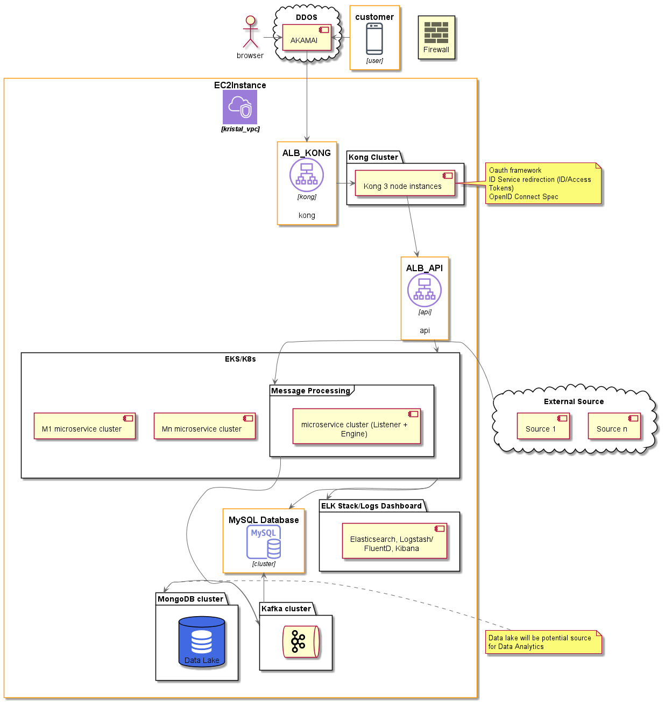

# portfolio-management
Kristal portfolio-management

Outputs Required:

1. Design and the assumptions associated.
Architecture design is as depicted below.

Assumptions - 

A> As the data is refreshed every 10 min, we can bring in Distributed Caching mechanism like Redis or Hazlecast, with key being the Asset symbol and value being ticker value from source with ttl as 10 min. so that ticker unit price can be read from the cache rather than DB. In-case of expired cache the value can be taken from DB.

B> Use of Prometheus, Micrometer and Grafana both for monitoring and usage statistics dashboard

C> Use of OPA - Open Policy Agent provides fine grained access control for internal microservices

D> Mentioned Mn Microservice as quite a number of microservice can be added like ID, User, Reporting, Notification, Transaction Processing, Payment Gateway services etc.    

E> Firewall in the picture should be placed in between outside world and  AWS VPC

F> Enable auto scaling feature of Kubernetes (KUBE\_ENABLE\_CLUSTER\_AUTOSCALER=true) for live namespace 

G> Microservices deployments using CI/CD pipelines - Jenkins, Artifactory/Docker Images, Terraform, Ansible, Helm Charts

### Architecture (High-Level Components)

2. List of any third party/ open sources used.
- AWS Cloud (RDS, EC2, EKS)
- Akamai for DDOS
- EKS
- Kafka
- MongoDB
- MySQL DB
- Kong API Gateway (DB Less)
 

3. Storage, Memory and cpu required.
AWS EC2 Instance
- T4 Large bare metal
- 64 vCPU
- 256 GB Memory

4. End to end implementation of any module.( working code)
To run the application:
- Download the source code from Git Hub
- Run the SQL Scripts under ./SQL/DB_Scripts.txt in your MYSQL prompt
- Run the application from Intellij/Eclipse
- Health checkup -> http://localhost:8080/health
- Configure Basic Auth user/password in Postman/Browser 
  user:kristal
  password:P@ssword
- In postman do a GET call on http://localhost:8080/v1/portfolio-management/acc0000001
  gives the expected output with TotalAssetValue
  for http://localhost:8080/v1/portfolio-management/acc0000004
  will give 404 Not Found meaning no data found for 'acc0000004' 